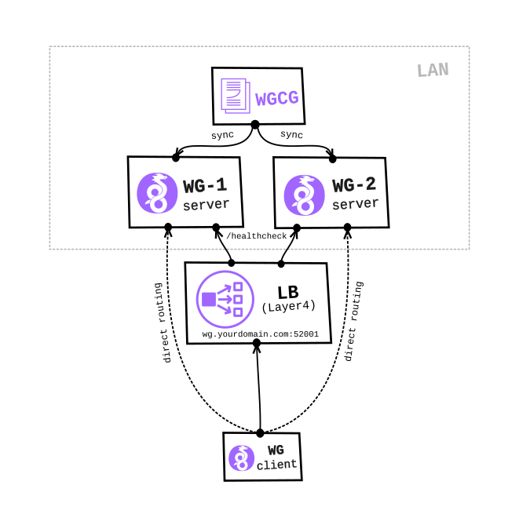

wireguard-tools
===============

Full documentation about manual Wireguard installation and configuration process can be found [here](https://gitlab.com/snippets/1897102).

wgcg.sh
-------

<div align="center">

</div>

### About

This script is created to ease manual process of Wireguard configuration and will help you to automatically generate all the required configuration files (client and server), PKI key pairs and preshared key.

### Install dependencies

**Arch**

```bash
pacman -S wireguard-tools gnupg qrencode
yay grepcidr
```

**Ubuntu**

```bash
apt-get install wireguard-tools gpg qrencode grepcidr
```

**MacOS**

```bash
brew install wireguard-tools gpg qrencode grepcidr
```

### Usage

Before running the script we'll have to update [wgcg.conf](./wgcg.conf) configuration file.  
For most use cases the only variable we'd have to modify is `WGCG_SERVER_PUBLIC_IP`.

```bash
# Server name (wireguard interface name e.g. wg0 || wg1 || wg2)
WGCG_SERVER_NAME="wg0"

# HostMin to HostMax range can be used to assign IP addresses to WireGuard clients
# e.g. ./wgcg.sh -c foo 10.0.0.2
#
# Network: 10.0.0.0/22
# HostMin: 10.0.0.1
# HostMax: 10.0.3.254
# HostIDs: 1022
#
# WireGuard server private IP address (with optional CIDR - default: 22)
WGCG_SERVER_WG_IP="10.0.0.1"

# Static server port
WGCG_SERVER_PORT="52001"

# Server's public IP or FQDN
WGCG_SERVER_PUBLIC_IP="wg.yourdomain.com"

# SSH server IP address (default: ${WGCG_SERVER_PUBLIC_IP}) (optional)
# Note: This option can be used in case SSH server is listening on different IP address,
#       if not specified, ${WGCG_SERVER_PUBLIC_IP} will be used instead
WGCG_SERVER_SSH_IP=""

# SSH server port (optional)
WGCG_SERVER_SSH_PORT="22"

# Space separated list of DNS IPs (default: 1.1.1.1 1.0.0.1) (optional)
WGCG_CLIENT_DNS_IPS="1.1.1.1 1.0.0.1"

# Space separated list of subnets (with CIDR) required for split-tunneling (default: 0.0.0.0/0) (optional)
WGCG_CLIENT_ALLOWED_IPS="0.0.0.0/0"

# All configuration and key files will be stored in this directory
WGCG_WORKING_DIR="${HOME}/wireguard/${WGCG_SERVER_NAME}"
```

Copy [wgcg.conf](./wgcg.conf) configuration file to the `wgcg` directory.

```bash
mkdir -p ${HOME}/wireguard/wgcg
cp wgcg.conf ${HOME}/wireguard/wgcg/
```

It is also possible to specify custom configuration file by passing `${WGCG_CONFIG_FILE}` environment variable.

```bash
WGCG_CONFIG_FILE=./wgcg.conf ./wgcg.sh
```

Print help and current default options.

```plain
# ./wgcg.sh -h
Usage:
  wgcg.sh options

Options:
  -P|--sysprep filename.sh                                  Install Wiregurad kernel module, required tools and scripts (will establish SSH connection with server)
  -s|--add-server-config                                    Generate server configuration
  -c|--add-client-config client_name client_wg_ip           Generate client configuration
  -B|--add-clients-batch filename.csv[:rewrite|:norewrite]  Generate configuration for multiple clients in batch mode
                                                            Supported action modes are 'rewrite' or 'norewrite' (default)
                                                            'rewrite' action mean regenerate ALL, 'norewrite' mean generate only configs and keys for new clients
  -e|--encrypt-config client_name [passphrase]              Encrypt configuration file by using symmetric encryption (if passphrase not specified it will be generated - RECOMMENDED)
  -d|--decrypt-config client_name                           Decrypt configuration file and print it out on STDOUT
  -r|--rm-client-config client_name                         Remove client configuration
  -q|--gen-qr-code client_name                              Generate QR code from client configuration file
  -l|--list-used-ips                                        List all client's IPs that are currently in use
  -S|--sync                                                 Synchronize server configuration (will establish SSH connection with server)
  -h|--help                                                 Show this help

Current default options:
  WGCG_SERVER_NAME="wg0"
  WGCG_SERVER_WG_IP="10.0.0.1"
  WGCG_SERVER_PORT="52001"
  WGCG_SERVER_PUBLIC_IP="wg.yourdomain.com"
  WGCG_SERVER_SSH_PORT="22"
  WGCG_CLIENT_DNS_IPS="1.1.1.1 1.0.0.1"
  WGCG_CLIENT_ALLOWED_IPS="0.0.0.0/0"
  WGCG_WORKING_DIR="/home/username/wireguard/wg0"
```

[wgcg-install-wireguard.sh](./modules/wgcg-install-wireguard.sh) module will do all required system preparations on the Wiregurad server (running the module is idempotent operation):

- Install `wireguard` kernel module and tools
- Load the module
- Generate `wgfw.sh` script
- Enable IP forwarding (routing)

**Note:** You have to run it only once!

```bash
./wgcg.sh --sysprep modules/wgcg-install-wireguard.sh
```

Generate server keys and config.

```bash
./wgcg.sh -s
```

Generate client config, PKI key pairs and update server config (add new Peer block)

```bash
./wgcg.sh -c foo 10.0.0.2
```

or to generate multiple client configs at once, create `client-configs.csv` file

```bash
cat > client-configs.csv <<'EOF'
foo,10.0.0.2
bar,10.0.0.3
EOF
```

and run.

```bash
./wgcg.sh -B client-configs.csv
```

By default `-B` will only generate client config and key files for newly added clients, if you plan to regenerate config and key files for ALL clients that are specified in the csv file,
you'll have to use `rewrite` action mode, globally or per client line, in case both are specified last one has precedence.

Global `rewrite` action mode

```bash
./wgcg.sh -B client-configs.csv:rewrite
```

or per client line.

**Note:** It is also possible to protect individual client from regenerating config and key files by specifying `norewrite` action.

```bash
cat > client-configs.csv <<'EOF'
foo,10.0.0.2,rewrite
bar,10.0.0.3,norewrite
EOF
```

Remove client config, PKI key pairs and update server config (remove Peer block).

```bash
./wgcg.sh -r foo
```

Synchronize local server configuration file with server (live update).

```bash
./wgcg.sh --sync
```

In order to send client configuration file safely to the client you can use GPG symmetric encryption to encrypt it before sending, then you can send configuration file to client via one channel and passphrase via different channel.

Encrypt configuration file.

```bash
./wgcg.sh -e foo
```

To test passphrase just run decrypt command, if everything is OK client configuration will be printed out on the standard output.

```bash
./wgcg.sh -d foo
```

<div align="center">

</div>

### Docker

It is also possible to run the script inside of Docker container with already preinstalled dependecies.

Build docker image.

```bash
docker build --no-cache --force-rm --build-arg USER=${USER} --build-arg UID=${UID} -t wgcg .
```

Run the script.

```bash
./wgcg-docker.sh -h
```

or if you are not using default configuration filename (`wgcg.conf`).

```bash
WGCG_CONFIG_FILE="${HOME}/wireguard/wgcg/wg0.conf" ./wgcg-docker.sh -h
```
